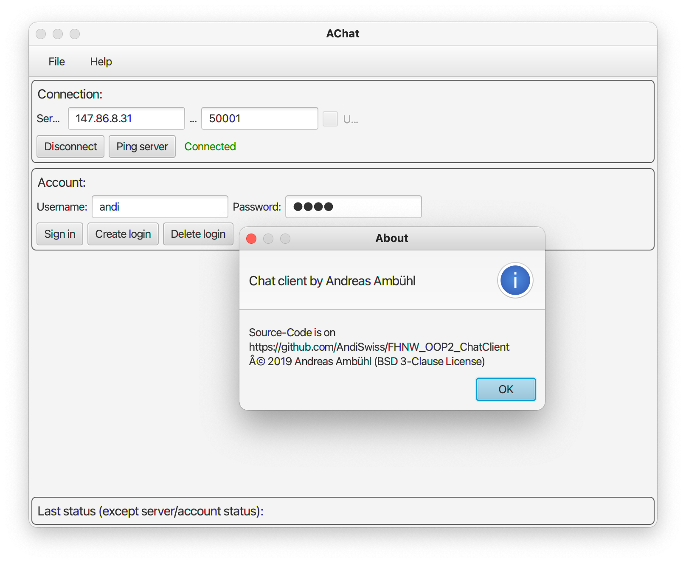

# AChat - a chat client by Andreas Ambühl

### General
This is my chat client for the semester project at FHNW in FS2019. The code is hosted on my GitHub: 
https://github.com/AndiSwiss -> FHNW_OOP2_ChatClient.

See a short description of the project-idea on my professor's website (including information about the server-port):
http://javaprojects.ch/chatroom.html. This server (http://javaprojects.ch) also serves as the main chat-server,
which can be used by this chat client.

The code for the chat-server is hosted here (GitLab-Repository of our teacher Bradley Richards):
https://gitlab.fhnw.ch/bradley.richards/java-projects

### Compiling and running the application
You need Java 8 and JavaFX installed.
The main-application is here:

[src/ch/andreasambuehl/achat/AChat.java](src/ch/andreasambuehl/achat/AChat.java)

### Feature list
- MVC
- Professional App Template
- multilingual
- extended button showing/hiding depending on state of the application
- detailed handling of account creating/deletion...
- sending/receiving messages from public chatrooms
- ...

### Constraints
####Thread running indefinitely
#####Problem
When trying to connect with a server with a wrong ip-address/port-number, then the
Error gets handled successfully and the program execution continues without further problems. But it seems, that
the thread which creates the socket and fails at this points just get stuck and never throws an error and so I cannot
catch any error. I have found no way to terminate such a thread which is just stuck (because it's not in a while-loop
or anything which would monitor a boolean or something). 

I documented my tries (and fails) inside ServerConnection.java -> in the following section:

`if (!socketConnected) {...}`
#####Temporary solution
The application works normally, but when quitting, you have to **force quit** the application, if you once tried to 
connect to a server using a wrong ip-/port-number combination during the application execution.

### Name of the app
The name AChat is somehow connected to my first and last name, but "Achat" is also the German name 
of a very beautiful mineral stone (English name: agate), which is sturdy, has nice patterns because of 
rhythmical crystallization. Furthermore, the agate can be found in many different colorful variations.
See also https://en.wikipedia.org/wiki/Agate

### License
BSD 3-Clause License. Copyright (c) 2019, Andreas Ambühl https://www.andreasambuehl.ch & Prof. Dr. Brad Richards (FHNW)

Most code is from my part, Andreas Ambühl. But some code fragments are from
Prof. Dr. Brad Richards; When I used Mr. Richards code, I left a a note in the
corresponding class or in the corresponding code-fragment.

See complete license in the [LICENSE.txt](LICENSE.txt)-file.
